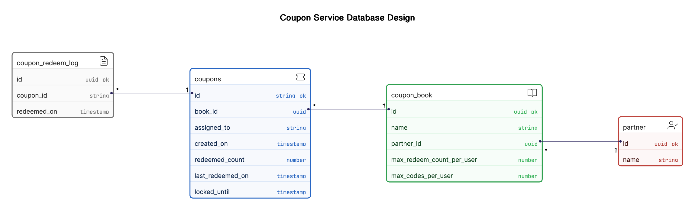

# Coupons

Code challenge solution for coupon generation service.
The solution includes a set of use cases, each described in its own file.
Each one outlines a feature of the service, and includes API endpoint
(request/response) definitions as well as pseudo code describing
the internal logic for that feature.

Challenge rules and spec can be found [**here**](challenge.pdf).

## Use Cases

1. [**Creating a book**](cases/create_book.md)
2. [**Generate or upload codes**](cases/add_codes.md)
3. [**Assigning codes**](cases/assign_code.md)
4. [**Locking codes**](cases/lock_code.md)
5. [**Unlocking codes**](cases/unlock_codes.md)
6. [**Redeeming codes**](cases/redeem_code.md)

## Assumptions

This design assumes that admin users (businesses using the service) will
be authenticated using JWT tokens in the API Gateway layer. There is no
auth code in the pseudo code for this reason, as it is assumed to happen
prior to the service being called.

## Database

The following ERD describes the shape of the data that the use cases assume.

## Infrastructure

The system is designed to be highly scalable and assumes the infrastructure shown below. There are some key decisions about the infrastructure that are made in this design:

1. A relational PostgreSQL database is used to store the data. This is
important, as the code assumes that ACID transactions are supported, as well
as specific transaction isonlation levels and lock behaviors.

2. The ideal configuration would be to use RDS Aurora, since it provides
connection pooling and other features that integrate well with AWS Lambda.

2. Endpoints are designed to be run on AWS Lambda (or equivalent
serverless platforms). This will allow the system to scale extremely well.

3. API Gateway is used to expose the endpoints to the outside world.
It allows endpoints to be authenticated and to apply rate limiting,
if needed, per partner. Also integrates with Cognito for partner authentication.

4. AWS EventBridge is used to schedule the unlock process on a timer.

5. The entire infrastructure is hosted within a private VPC for
security reasons.

